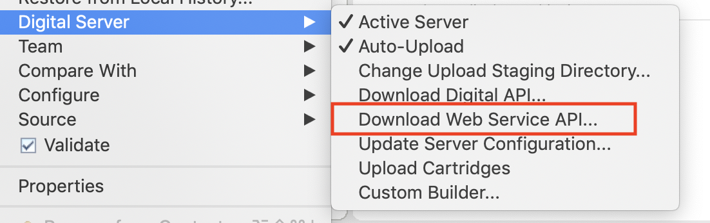

# sfcc_download_web_service_api_docs
Python utility to download &amp; generate API documentation for SOAP webservices

Official SFCC plugin UXStudio has a feature by which you can download the soap service API documentation. Now days, not everyone is using Eclipse so this utility can be used to not rely on Eclipse and generate the soap service api documentation from cli.



# How does the official plugin works

1. SFCC generates the compiled java classes for soap services on the server. This is only generated when the service is actually executed on the server.
2. UXStudio downloads the generated java files on the user's machine.
3. UXStudio extract's the zip folder & runs `javadoc` on it to generate the documentation.

WSDL file can be in either `webreferences` or `webreferences2` folder.

For `webreference` generated java files on server are located at https://xyz.demandware.net/on/demandware.servlet/WFS/StudioWS/Sites/webrefgen/webreferences/{WSDL_NAME}/{WSDL_NAME}.api.zip

For `webreference2` generated java files on server are located at https://xyz.demandware.net/on/demandware.servlet/WFS/StudioWS/Sites/webrefgen2/{WSDL_NAME}/{WSDL_NAME}.api.zip

# Note
The official feature from SFCC only works with JDK8. So, because of that limitation this script also relies on JDK8 being installed on the system. In versions above JDK8 javadoc is not generated from the compiled java class files.

For Linux/OS X (jEnv)[https://www.jenv.be/] can be used to switch between different java versions.

# Usage

### Installation

This utility/script works on python version 3.XX. So, make sure you have python3 & pip3 installed on your system. pip is a package installer for python. Once both python3 & pip3 are installed on your system run the following command to install the dependencies.

`pip3 install -r requirements.txt`

### Configuration

Configure the instance hostname, username & password in the config.ini file.

1. Rename the sample `config.ini.sample` to `config.ini`
2. Add instance hostname, username, password
3. WEBREFERENCE_FOLDER can be either `webreferences` or `webreferences2`
4. WSDL_FILE_NAME is name of your wsdl. So, for `taxsvc.wsdl` this will be `taxsvc`

### Execution

Run the following command to start downloading and generating the docs

`python3 index.py or python index.py`

Example output:

```python
python3 index.py
Going to download webservice api docs from url https://xyz.demandware.net/on/demandware.servlet/WFS/StudioWS/Sites/webrefgen/webreferences/taxsvc/taxsvc.api.zip

API docs zip downloaded to /Users/raghuwanshi/clone/sfcc_download_web_service_api_docs/taxsvc.zip

API docs zip extracted to /Users/raghuwanshi/clone/sfcc_download_web_service_api_docs/output

change current working directory to /Users/raghuwanshi/clone/sfcc_download_web_service_api_docs/output/webreferences/taxsvc/

generating java docs....
javadoc generated under /Users/raghuwanshi/clone/sfcc_download_web_service_api_docs/output/webreferences/taxsvc/docs
```

# Javadocs

In order for this feature to work `javadoc` should be added in PATH variables. This script relies on running `javadoc` on shell/cmd.exe.

If for some reason you are not able to add javadoc in PATH variable you can always disable javadoc feature in `config.ini` and manually run the javadoc from your preferred shell on the extracted the java class files.

# Note

This script is only tested on OSX but as long as above steps are followed it should also work on a windows machine.
